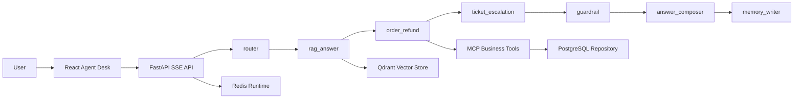

# SmartCS Agent Desk Architecture

## Runtime Flow

## Agent Harness

The eval harness replays synthetic e-commerce cases through the same orchestrator used by the API. It records intent accuracy, required tool coverage, citation hit rate, PII leakage, unsafe-request blocking, and latency. The default run uses `MockLLMProvider` to keep CI deterministic and free.

## Production Swap Points

- `LLMProvider`: switch `LLM_PROVIDER=openai` and set `OPENAI_API_KEY`, `OPENAI_API_BASE`, `MODEL_NAME`.
- `PostgresRepository`: stores users, orders, refunds, tickets, conversations, messages, agent steps, tool calls, and trace IDs.
- `RedisRuntimeService`: stores short-term memory, stream events, and rate-limit counters.
- `QdrantKnowledgeStore`: stores seeded and manually ingested knowledge chunks as vectors with metadata filters.
- `BusinessToolRegistry`: expose the same methods through `FastMCP` via `app.tools.mcp_server`.
