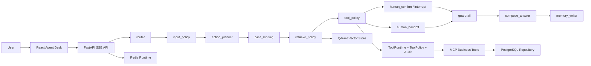

# SmartCS Agent Desk Architecture

## Runtime Flow

## Agent Harness

The eval harness replays categorized e-commerce cases through the same orchestrator used by the API. It records intent accuracy, tool selection, tool argument correctness, citation hit rate, groundedness, handoff precision, task success, PII leakage, unsafe-request blocking, and latency. The default run uses `MockLLMProvider` to keep CI deterministic and free.

## Production Swap Points

- `LLMProvider`: switch `LLM_PROVIDER=openai-compatible` and set `OPENAI_API_KEY`, `OPENAI_API_BASE`, `MODEL_NAME`.
- `PostgresRepository`: stores users, orders, refunds, tickets, cases, tasks, tool audits, conversations, messages, agent steps, tool calls, and trace IDs.
- `RedisRuntimeService`: stores short-term memory, stream events, and rate-limit counters.
- `QdrantKnowledgeStore`: stores seeded and manually ingested knowledge chunks as vectors with metadata filters, reranking, and grounding metadata.
- `ToolRuntime`: wraps `BusinessToolRegistry` with AuthContext binding, ToolPolicy, confirmation, idempotency, and audit.

## Design Decisions

### ADR-001: Explicit Orchestrator Before Free-Form ReAct

SmartCS keeps the live customer-service flow in a bounded orchestrator sequence so every node emits traceable SSE events and can be regression-tested. A LangGraph parity adapter now exposes a compiled graph contract, but the default executor remains the explicit orchestrator until parity gates are broadened.

### ADR-002: Side Effects Require Confirmation And Idempotency

Read tools can execute directly, while side-effect tools such as refund creation and handoff are wrapped by `ToolPolicy`, confirmation tasks, idempotency keys, and tool audit logs. This makes retry and resume behavior inspectable.

### ADR-003: Deterministic Mock Mode Is A Release Gate

CI uses the mock provider and fixed JSONL fixtures so prompt, tool, and KB regressions are reproducible without model keys. Live-model evaluation is a later comparison layer, not the baseline gate.

### ADR-004: Infrastructure Adapters Are Optional

PostgreSQL, Redis, and Qdrant adapters are production-style swap points. The in-memory fallbacks keep local review fast, while integration tests prove the real service adapters cooperate when containers are available.
